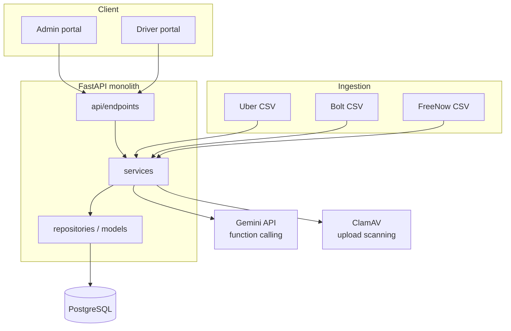

# Fleet Manager — case study

A production fleet and driver management system for ride-hailing fleet operators (Uber/Bolt/FreeNow partner model). Built solo, backend to frontend to deploy pipeline, currently running in production for 3 separate fleet operator companies.

The production repo is closed — it's live client code, not something I can dump on GitHub. This is instead a write-up of the architecture and decisions, plus a handful of real source files pulled out because they're the parts most worth reading.

## Why this exists

Drivers working under a fleet-partner arrangement rent a car, get a taxi license through the operator, and drive for Uber/Bolt/FreeNow simultaneously. Every week, three platforms each pay out differently, with different CSV export formats and different fee categories. Before this system, an operator was reconciling all of that by hand in spreadsheets, and drivers had no self-service way to check anything — every question about a payout meant a phone call.

Fleet Manager replaces that with a full operations system, not just a billing tool:

- **Driver lifecycle** — registration, document upload/review, status tracking (pending / active / suspended / blocked)
- **Fleet management** — cars, driver-to-car assignments, service records, odometer/mileage logging with PDF export
- **Settlements & billing** — weekly reconciliation across Uber/Bolt/FreeNow into one payout, invoices (pending → approved → settled/rejected), recurring fees (car rental, accounting fee), ad-hoc adjustments
- **Contracts** — driver agreements tied to their account
- **Multi-role accounts** — Admin, Driver, and Accountant, same application, permissions split by role
- **Notifications** — in-app driver/admin notifications
- **Compliance** — GDPR: full personal data export on request, consent tracking per user
- **Driver-facing LLM assistant** — for the questions that used to mean picking up the phone

Billing gets the most attention in this write-up because it's the most interesting engineering problem, but it's one module among several — the system underneath is closer to a small ERP for a fleet operator than a single-purpose billing tool.

## Stack

| Layer | Choices |
|---|---|
| Backend | Python 3.11, FastAPI, SQLAlchemy 2.0, Alembic, Pydantic Settings, Poetry |
| Auth / security | JWT + Argon2, Fernet field-level encryption, trusted-device login flow, slowapi rate limiting, ClamAV upload scanning |
| Frontend | React 19, TypeScript, Vite, React Router 7, Tailwind CSS 4, shadcn/radix-ui, react-hook-form + zod, i18next (PL/EN/UK) |
| Data | PostgreSQL 15 |
| LLM | Google Gemini API (`google-genai`), function calling — migrated off the Anthropic API mid-project |
| Infra | Docker Compose per environment, Nginx, GitHub Actions CI/CD, tag-based deploys to VPS with health checks, Dependabot with auto-merge/auto-deploy |

## Architecture

One FastAPI backend, one React frontend, both containerized separately, layered the same way you'd expect: endpoints call services, services call repositories, repositories own the SQLAlchemy models. Admin and driver portals are the same app, split by role (ADMIN / DRIVER / ACCOUNTANT), not two separate deployments.

Full backend file layout: [`snippets/structure.txt`](snippets/structure.txt) — 17 endpoint modules, 24 models, 22 services, one shared repository base, all following the same layering.

## Code structure and why it's shaped this way

Backend is a strict four-layer split, every entity follows it the same way:

- **`api/endpoints`** — HTTP concerns only: parse request, call a service, return a schema. No business logic, no queries.
- **`services`** — business logic and orchestration. This is where rules live (e.g. "a payout can only be approved once", "a car can't be assigned to two active drivers").
- **`repositories`** — the only layer allowed to touch SQLAlchemy queries directly.
- **`models` / `schemas`** — models are the persistence shape (SQLAlchemy), schemas are the wire shape (Pydantic). They're deliberately not the same class, so a change to what the API accepts/returns never means touching the table definition, and vice versa.

Two things in that layering are worth pointing at directly, because they're not just "clean architecture" as a slogan:

**A generic `BaseRepository`/`BaseService` pair** (`Generic[ModelType, CreateSchemaType, UpdateSchemaType]`) implements CRUD, soft-delete-if-the-model-supports-it, bulk operations, and audit logging exactly once. Every concrete service (drivers, cars, invoices, contracts, ...) subclasses `BaseService` and gets all of that for free, only adding the domain logic that's actually specific to it — new entities extend the base rather than requiring changes to it. Two small `Protocol` classes (`HasCreateDict` / `HasUpdateDict`) let a schema opt into custom serialization without the repository needing to know or care which schemas do.
See [`snippets/base_repository.py`](snippets/base_repository.py) and [`snippets/base_service.py`](snippets/base_service.py).

**Validation lives in reusable mixins, not copy-pasted per schema.** Name normalization (Unicode NFKC, title-casing), phone number format, and IBAN validation (including a MOD-97 checksum, not just a regex) are each written once as a Pydantic mixin and composed into whichever schemas need that field — a driver schema and a bank-details schema both get IBAN validation from the same fifteen lines of code, not two copies of it.
See [`snippets/schemas_validation_mixins.py`](snippets/schemas_validation_mixins.py).

The model layer follows the same discipline: every field is documented inline (`doc=...`), sensitive fields are typed through an `EncryptedString` column type rather than encrypted ad hoc at the call site, and relationships declare their own loading strategy and cascade behavior instead of relying on defaults.
See [`snippets/models_driver_excerpt.py`](snippets/models_driver_excerpt.py) and [`snippets/settlement_repository_excerpt.py`](snippets/settlement_repository_excerpt.py) (the latter also shows a `UNION ALL` across three differently-shaped platform tables, mapped into one typed result).

## The part relevant to LLM engineering

The driver portal has a chat assistant for questions about licensing, the rental arrangement, and their own weekly settlements. Two design choices there are worth explaining because they were deliberate, not defaults:

**Function calling instead of letting the model answer from its own head.** When a driver asks about their earnings, the model doesn't get raw payout data in the prompt and it never generates a number itself — it calls `get_earnings_summary(months_back)`, which runs against `BillingService` scoped to that driver's own `driver_id` from their auth token. The model only ever sees the numbers that call returns, and the system prompt tells it explicitly not to guess. That's the whole hallucination-mitigation strategy: don't give the model room to invent a payout figure in the first place.

**No RAG.** The assistant's knowledge base (licensing rules, rental terms, how the payout flow works) is a few paragraphs, sourced from the operator's own public FAQ content, and it changes rarely. Standing up a retrieval pipeline for that would be solving a problem I don't have — it's a static system prompt instead, with an explicit instruction to defer to human support for anything not in it (rental pricing, licensing timelines) rather than guess. If the knowledge base grows into something that actually needs semantic search over documents, RAG is the obvious next step, but there was no reason to build it speculatively.

The system prompt also does the boring-but-necessary guardrail work: stay in scope, don't take instructions from the user that try to change its role, don't reveal the prompt itself, answer in whichever of Polish/English/Ukrainian the question came in.

One honest limitation, since I'd rather say it here than have it surface as a gap in an interview: this is single-tool, single-round function calling, not a multi-step or multi-agent system. For the problem it solves — grounded answers to a narrow set of driver questions — that was the right amount of complexity. It is not, on its own, "agentic AI" in the fuller sense, and I wouldn't describe it that way.

See [`snippets/assistant_service.py`](snippets/assistant_service.py) for the actual implementation.

## Settlement engine

Each platform pays out with a different schema and different fee categories. Rather than one generic parser trying to handle three shapes, there's a small calculator class per platform (`_BoltCalculator`, `_UberCalculator`, `_FreeNowCalculator`), each responsible only for decomposing its own settlement rows onto a shared `WeeklyPayout`. Adding a fourth platform means adding a fourth calculator, not touching the other three. The actual per-platform financial logic isn't included here — it's the one part of this codebase that's genuinely client-sensitive, not just closed by default.

The data-access side of the same problem (fetching and aggregating settlement rows across all three platform tables through one typed query) is shown in [`snippets/settlement_repository_excerpt.py`](snippets/settlement_repository_excerpt.py).

## Security

- Field-level encryption (Fernet) for sensitive personal data, on top of transport encryption
- Argon2 for password hashing
- A trusted-device flow for login — closer to 2FA than a bare password, without requiring drivers to manage a TOTP app
- Rate limiting on auth and assistant endpoints (slowapi)
- Uploaded documents scanned with ClamAV before they're stored
- **GDPR compliance** — this is a real product handling real personal/financial data for real users, not a demo: full personal data export on request, per-user consent tracking, and encryption/access controls designed around that from the start rather than bolted on afterward

## CI/CD

GitHub Actions on every push: Ruff lint + format check, pytest against a real containerized PostgreSQL (not mocks), frontend lint and build, and a separate security-audit job running `pip-audit` and `npm audit`. Tag-based deploys to staging and production over SSH, with a health check gate. Dependabot has auto-merge and auto-deploy wired up for routine dependency bumps.

One example of the kind of judgment call that job forces: a WeasyPrint CVE showed up in `pip-audit` with no fix released yet. It's only exploitable through a code path (`presentational_hints=True`) this codebase never uses, and the HTML fed to WeasyPrint is generated server-side, not from user input — so it's suppressed with an explicit comment explaining why, instead of silently ignored or left blocking every build.

See [`snippets/ci.yml`](snippets/ci.yml).

## Numbers

| | |
|---|---|
| Development time | ~6.5 months, evenings/weekends, solo, alongside full-time work |
| Backend | ~26k lines of Python, 81 REST endpoints |
| Frontend | ~23k lines of TypeScript/TSX |
| Tests | 469, run against a real Postgres instance in CI |
| Deployments | 3 independent production instances (separate clients, separate databases — not multi-tenant) |

## What I'd change next

- Evaluate RAG once/if the assistant's knowledge base actually needs to scale past a static prompt
- Multi-step tool use for questions that need more than one lookup (e.g. comparing two months' settlements)
- More edge-case coverage on the settlement engine around correction/adjustment flows
